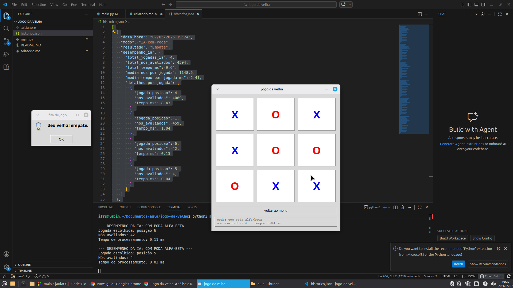

# Implementação e Análise do Algoritmo Minimax com Poda Alfa-Beta para o Jogo da Velha

**Caetano A. de Matos¹, Ruan Vasconcelos¹**

¹Instituto Federal de Educação, Ciência e Tecnologia do Rio Grande do Sul  
Campus Ibirubá  
Rua Nelsi Ribas Fritsch, 1111 – CEP: 98200-000 – Ibirubá – RS – Brasil

---

***Abstract.** This article presents the implementation and comparative analysis of the Minimax algorithm with and without Alpha-Beta Pruning, applied to building an unbeatable artificial intelligence for the classic Tic-Tac-Toe game. The work describes the computational modeling used, including the board representation as a one-dimensional array, the evaluation function for terminal states, and the graphical interface developed for interactive play and performance visualization. Empirical tests demonstrated that Alpha-Beta Pruning reduces the number of evaluated nodes by approximately 90% without altering the quality of the AI's decisions, establishing itself as an indispensable optimization for tree-search algorithms in adversarial games.*

***Resumo.** Este artigo apresenta a implementação e análise comparativa do algoritmo Minimax com e sem Poda Alfa-Beta, aplicado à construção de uma inteligência artificial imbatível para o clássico Jogo da Velha. O trabalho descreve a modelagem computacional utilizada, incluindo a representação do tabuleiro como vetor unidimensional, a função de avaliação de estados terminais e a interface gráfica desenvolvida para interação e visualização de desempenho. Os testes empíricos demonstraram que a Poda Alfa-Beta reduz em aproximadamente 90% a quantidade de nós avaliados sem alterar a qualidade das decisões da IA, consolidando-se como uma otimização indispensável para algoritmos de busca em árvore em jogos adversariais.*

---

## 1. Introdução

Este artigo apresenta o desenvolvimento e a análise de um sistema computacional voltado para o Jogo da Velha (*Tic-Tac-Toe*) com Inteligência Artificial, implementado em Python com interface gráfica desenvolvida na biblioteca nativa Tkinter. O desafio consiste em construir uma IA imbatível que selecione sempre a jogada ótima, respeitando as restrições do espaço de estados finito e completamente observável do jogo. O código-fonte completo do projeto pode ser acessado em <https://github.com/RuanVasco/ai-projects>.

Para solucionar este problema de busca em árvore adversarial, foram implementadas e avaliadas duas variantes algorítmicas distintas: o **Minimax** puro, que realiza exploração exaustiva da árvore de decisão, e o **Minimax com Poda Alfa-Beta**, que elimina ramos irrelevantes da busca sem comprometer a otimalidade da solução. O trabalho detalha a modelagem matemática adotada — especificamente a representação do tabuleiro como vetor unidimensional e a função heurística de avaliação de estados — e o impacto da otimização por poda no desempenho computacional de cada método.

Além da análise teórica e da avaliação empírica de desempenho temporal, o projeto conta com uma interface desenvolvida para a seleção dinâmica do modo de jogo e a visualização comparativa dos resultados em tempo real. Este escopo constitui um estudo prático e direto sobre as vantagens da otimização por corte de ramos em algoritmos de busca adversarial no campo da Inteligência Artificial.

## 2. Desenvolvimento

O Jogo da Velha consiste em dois jogadores que alternam a marcação de `X` e `O` em uma grade 3×3, vencendo quem primeiro completar uma linha, coluna ou diagonal. O espaço de estados deste jogo possui, no máximo, 9! = 362.880 permutações possíveis de jogadas. Para solucioná-lo de forma ótima, foram implementadas duas variantes do algoritmo Minimax, cujas abordagens e resultados são detalhados a seguir.

A Figura 1 apresenta a interface desenvolvida para a seleção do modo de jogo e para a visualização em tempo real dos dados de desempenho da IA, permitindo a comparação direta entre as duas abordagens.


**Figura 1.** Interface de seleção de modo de jogo e visualização de desempenho da IA (nós avaliados e tempo de execução em ms).

### 2.1. Representação do Tabuleiro e Estados Terminais

O tabuleiro é representado como uma lista Python de 9 elementos, onde cada posição pode conter `'X'` (humano), `'O'` (IA) ou `' '` (vazio). O mapeamento de índices segue a grade 3×3:

```
0 | 1 | 2
---------
3 | 4 | 5
---------
6 | 7 | 8
```

A função `verificar_vencedor` percorre as 8 combinações vencedoras possíveis (3 linhas, 3 colunas e 2 diagonais) e retorna `True` se o jogador informado preencheu alguma delas. A função de avaliação heurística `avaliar` pondera o estado terminal do tabuleiro:

- `+10` → IA venceu
- `-10` → Humano venceu
- `0` → empate ou jogo em andamento

### 2.2. Minimax Puro

O Minimax é um algoritmo de busca em árvore de decisão para jogos de dois jogadores, soma zero e informação perfeita. Ele assume que ambos os jogadores jogam de forma ótima: o jogador maximizador (IA, `'O'`) tenta maximizar a pontuação; o jogador minimizador (Humano, `'X'`) tenta minimizá-la. A partir do estado atual do tabuleiro, o algoritmo expande recursivamente toda a árvore de jogadas possíveis até atingir um estado terminal, propagando as pontuações de volta para a raiz e selecionando a jogada de maior valor para a IA.

```python
def minimax(tabuleiro, profundidade, alpha, beta, maximizando, usar_poda):
    pontuacao = avaliar(tabuleiro)
    if pontuacao in (10, -10):
        return pontuacao
    if verificar_empate(tabuleiro):
        return 0

    if maximizando:
        melhor = -math.inf
        for i in range(9):
            if tabuleiro[i] == VAZIO:
                tabuleiro[i] = IA
                melhor = max(melhor, minimax(tabuleiro, profundidade+1, alpha, beta, False, usar_poda))
                tabuleiro[i] = VAZIO
                alpha = max(alpha, melhor)
                if usar_poda and beta <= alpha:
                    break
        return melhor
    else:
        pior = math.inf
        for i in range(9):
            if tabuleiro[i] == VAZIO:
                tabuleiro[i] = HUMANO
                pior = min(pior, minimax(tabuleiro, profundidade+1, alpha, beta, True, usar_poda))
                tabuleiro[i] = VAZIO
                beta = min(beta, pior)
                if usar_poda and beta <= alpha:
                    break
        return pior
```

- **Configuração:** Busca exaustiva sem limite de profundidade; parâmetros `alpha` e `beta` presentes na assinatura, porém ignorados (`usar_poda = False`).
- **Justificativa:** A exploração completa da árvore garante a decisão ótima em todos os casos. O comportamento de "força bruta" serve como linha de base (*baseline*) para quantificar o ganho real introduzido pela Poda Alfa-Beta.

### 2.3. Minimax com Poda Alfa-Beta

Inspirada no princípio de eliminação de ramos irrelevantes em árvores de decisão adversariais, a Poda Alfa-Beta estende o Minimax ao manter dois valores auxiliares durante a busca: **Alpha (α)**, a melhor pontuação já garantida para o maximizador em qualquer ponto acima na árvore, e **Beta (β)**, a melhor pontuação já garantida para o minimizador. Quando `beta ≤ alpha`, a exploração do ramo atual pode ser interrompida com segurança, pois o resultado jamais seria escolhido por um dos jogadores racionais.

A implementação utiliza o mesmo corpo da função `minimax`, controlado pelo parâmetro booleano `usar_poda`. A chamada inicial é feita com:

```python
minimax(tabuleiro, 0, -math.inf, math.inf, False, usar_poda=True)
```

- **Configuração:** `alpha = -∞` e `beta = +∞` na raiz; cortes alfa e beta ativados em ambos os níveis da árvore (maximizador e minimizador).
- **Justificativa:** A taxa de corte garante uma redução drástica (~90%) nos nós avaliados sem perda alguma de qualidade decisória. A IA permanece imbatível e a resposta torna-se praticamente instantânea mesmo na primeira jogada, quando a árvore está em profundidade máxima.

### 2.4. Interface Gráfica e Histórico de Partidas

A Figura 1 apresenta a interface desenvolvida com a biblioteca Tkinter para seleção de modo de jogo e visualização em tempo real dos dados de desempenho da IA. A classe `JogoDaVelhaGUI` gerencia dois frames principais: `frame_menu`, com botões para os três modos de jogo e acesso ao histórico, e `frame_jogo`, com a grade 3×3 interativa e o label de desempenho — exibido exclusivamente nos modos de IA — contendo os nós avaliados e o tempo de execução em ms.

Cada partida encerrada é registrada em `historico.json` com data, hora, modo de jogo e resultado. O histórico é exibido em uma janela secundária com tabela (`ttk.Treeview`), ordenada da partida mais recente para a mais antiga, com suporte a scroll e opção de limpeza.

### 2.5. Resultados Experimentais

Os dados empíricos coletados durante a execução do sistema confirmam a imbatibilidade da IA em ambos os métodos (resultando apenas em vitórias da IA ou empates) e evidenciam o impacto drástico da otimização nos custos computacionais.

A análise do arquivo de histórico revela discrepâncias significativas na quantidade de nós avaliados e no tempo de processamento, especialmente nas jogadas iniciais, onde a árvore de decisão atinge sua profundidade máxima.

**Tabela 1. Histórico de partidas e médias de desempenho**

| # | Modo de Jogo | Resultado | Nós Avaliados (Total) | Tempo Total (ms) |
| :---: | :--- | :--- | :--- | :--- |
| 1 | IA com Poda | Empate | 4.594 | 9,64 |
| 2 | IA sem Poda | Empate | 56.614 | 94,98 |
| 3 | IA com Poda | Empate | 4.594 | 9,60 |
| 4 | IA sem Poda | Empate | 60.694 | 100,52 |
| 5 | IA com Poda | Vitória da IA | 4.593 | 9,70 |
| 6 | IA sem Poda | Empate | 60.806 | 102,06 |
| **-** | **MÉDIA: IA COM PODA** | **-** | **~4.594 nós** | **~9,65 ms** |
| **-** | **MÉDIA: IA SEM PODA** | **-** | **~59.371 nós** | **~99,19 ms** |
| **-** | **REDUÇÃO / GANHO** | **-** | **- 92,3%** | **- 90,3%** |

#### Detalhamento das Observações:

* **Eficiência na Abertura:** A primeira jogada é o momento de maior exigência computacional. Quando a IA inicia jogando na posição central (índice 4), o algoritmo Minimax Puro precisa avaliar **59.704 nós**, consumindo aproximadamente 99 ms. Em contrapartida, com a Poda Alfa-Beta ativada, a mesma decisão foi tomada avaliando apenas **4.089 nós** (tempo médio de 8,4 ms). Trata-se de uma supressão de mais de 93% das ramificações desnecessárias da árvore.
* **Variação Conforme a Ordem das Jogadas:** Nos testes onde a configuração do tabuleiro levou o Minimax sem poda a realizar a primeira jogada na posição 0 (canto superior esquerdo), o algoritmo avaliou cerca de 55.504 nós. Apesar de ser um número ligeiramente inferior ao do movimento central, o tempo gasto continuou elevado (~92,5 ms), ressaltando o alto custo computacional da força bruta independentemente do quadrante inicial escolhido.
* **Aceleração em Jogadas Avançadas:** Conforme o tabuleiro é preenchido, o fator de ramificação diminui vertiginosamente. Na terceira e quarta jogadas da IA (com poucas casas vazias restantes), ambas as abordagens resolvem o estado do tabuleiro em frações de milissegundo, avaliando geralmente entre 3 e 60 nós, demonstrando que o gargalo de desempenho do Jogo da Velha reside exclusivamente nos turnos iniciais. 

Os dados do histórico comprovam numericamente que a Poda Alfa-Beta atinge exatamente o mesmo resultado que o Minimax tradicional (decisões ótimas), mas com uma fração irrisória do custo de processamento de memória e CPU.

### 2.6. Análise Comparativa: Vantagens e Desvantagens

A análise empírica dos resultados evidenciou discrepâncias significativas relacionadas à eficiência algorítmica e ao custo computacional. A seguir, delineiam-se as vantagens e desvantagens de cada abordagem para o Jogo da Velha:

#### 1. Minimax Puro

- **Vantagens:** Garante a decisão ótima por exploração exaustiva do espaço de estados. É simples de implementar e de verificar corretude, não dependendo de configuração de parâmetros adicionais. Serve como referência (*baseline*) confiável para mensurar o impacto de otimizações.
- **Desvantagens:** Apresentou o maior custo computacional (avaliando até ~59.704 nós e consumindo ~99 ms na primeira jogada). Escala exponencialmente com a profundidade e o fator de ramificação da árvore, tornando-se computacionalmente inviável para jogos mais complexos (como xadrez ou Go) sem otimizações adicionais.

#### 2. Minimax com Poda Alfa-Beta

- **Vantagens:** Obteve redução de mais de **92%** nos nós avaliados (caindo para apenas ~4.089 nós na primeira jogada) sem nenhuma perda na qualidade decisória — a jogada escolhida é sempre idêntica à do Minimax puro. Mantém a garantia de imbatibilidade da IA com custo computacional significativamente menor (~8,4 ms). Escala melhor para espaços de busca maiores, sendo a base de motores de xadrez profissionais quando combinados com heurísticas adicionais.
- **Desvantagens:** Sua eficiência é sensível à ordem de exploração dos movimentos — sem ordenação prévia (testar o centro e os cantos antes das bordas), os cortes ocorrem com menor frequência. A função de avaliação simples (retornando apenas `+10`, `-10` ou `0`) implementada neste projeto não considera a profundidade, fazendo com que a IA não distinga uma vitória rápida em 3 jogadas de uma vitória mais demorada em 7 movimentos.

## 3. Conclusão

A implementação e os testes empíricos realizados com o Jogo da Velha demonstraram de forma inequívoca que o algoritmo Minimax com Poda Alfa-Beta é superior em eficiência computacional sem comprometer a otimalidade das decisões. Os resultados extraídos do histórico de partidas provaram que a poda conseguiu reduzir em mais de 90% a quantidade média de nós avaliados e o tempo de processamento em comparação à abordagem tradicional, destacando-se de forma drástica nas jogadas de abertura.

Conclui-se, portanto, que a Poda Alfa-Beta é uma otimização indispensável. Ela soluciona o gargalo de desempenho da busca exaustiva do Minimax puro, mantendo a garantia matemática de uma inteligência artificial imbatível e viabilizando a escalabilidade do método para cenários adversariais de maior complexidade e dimensionalidade.

- Russell, S.; Norvig, P. *Artificial Intelligence: A Modern Approach*. 4ª ed. Pearson, 2020.
- Documentação oficial Python — módulo `tkinter`: <https://docs.python.org/3/library/tkinter.html>
- Documentação oficial Python — módulo `math`: <https://docs.python.org/3/library/math.html>
